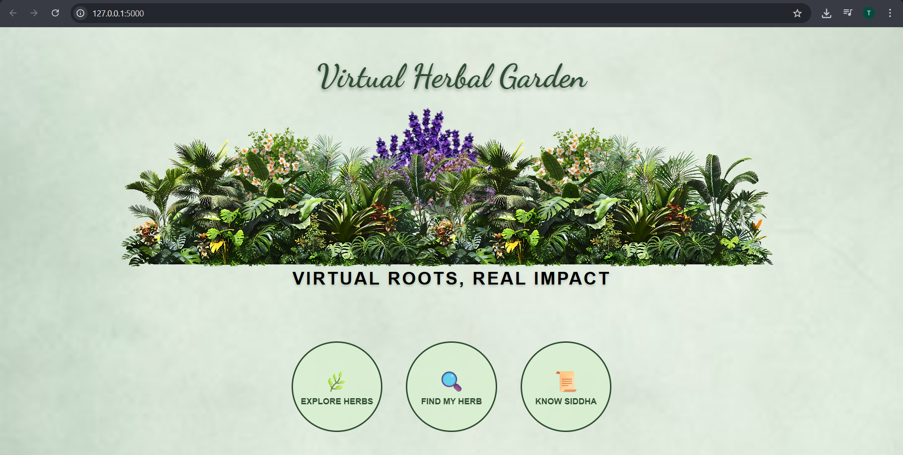
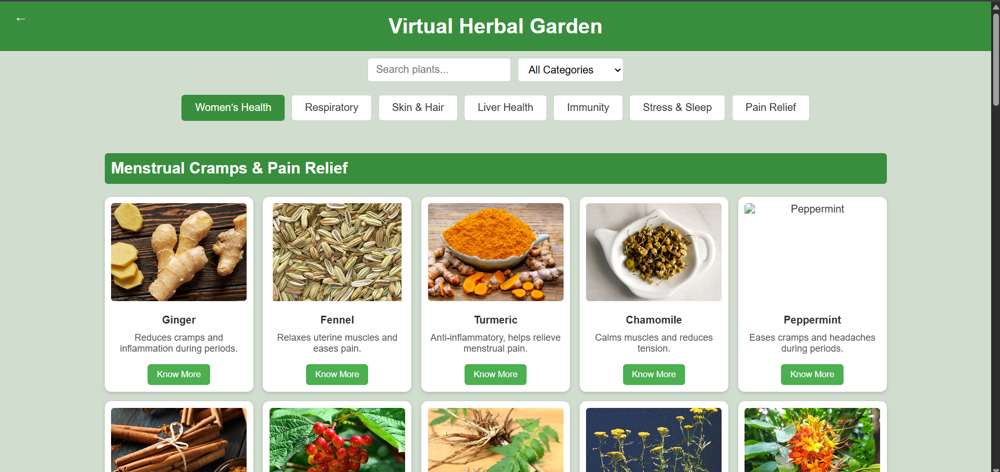
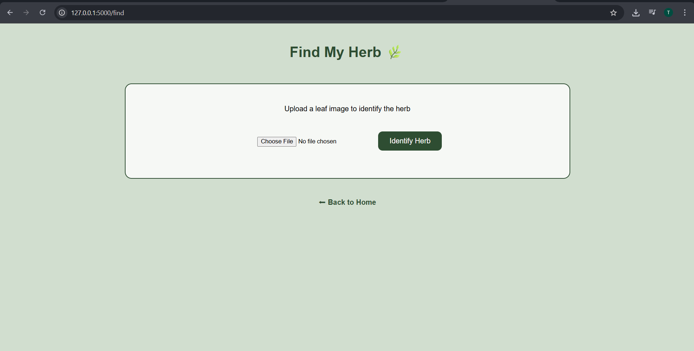
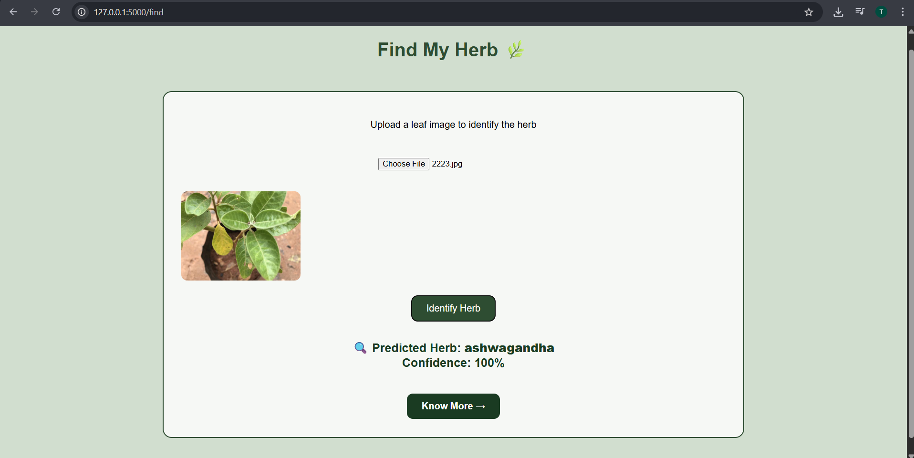
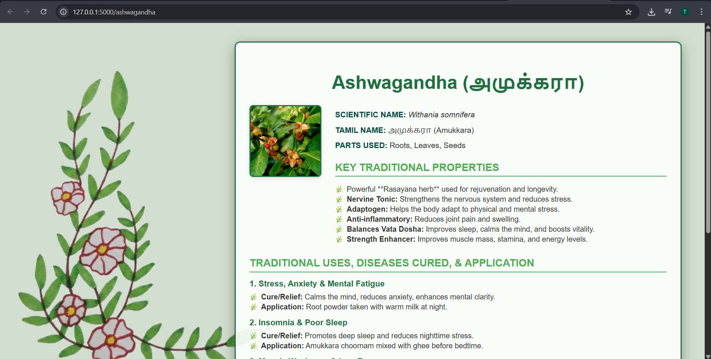
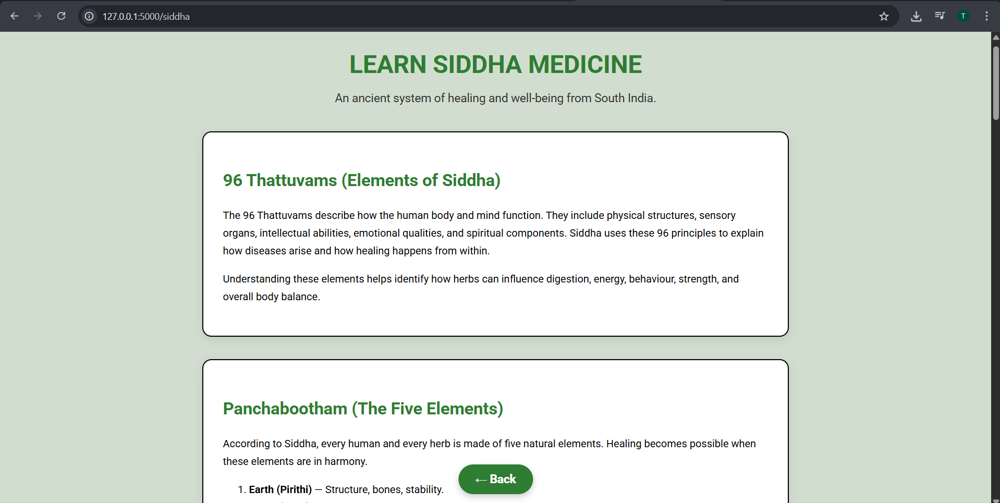

# Virtual Herbal Garden

This is a Flask-based web application that helps users explore medicinal plants and identify them using a machine learning model.

## Features
- Explore different medicinal plants
- View detailed plant pages
- Plant identification using ML model
- Siddha medicine information

## Technologies Used
- Python
- Flask
- HTML/CSS
- TensorFlow / Teachable Machine model

## How to Run
1. Install dependencies
pip install -r requirements.txt

2. Run the Flask server
python server.py

3. Open browser
http://127.0.0.1:5000
## Project Screenshots

### Home Page

### Explore Herbs

### Find my herb

### Detection page

### Herb information

### Know Siddha

